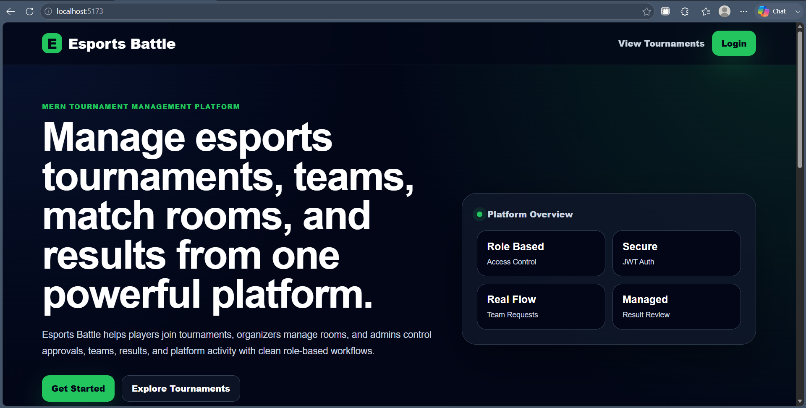
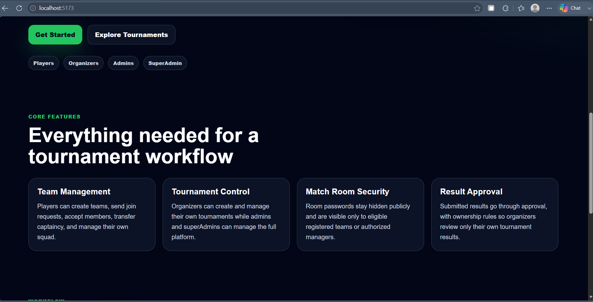
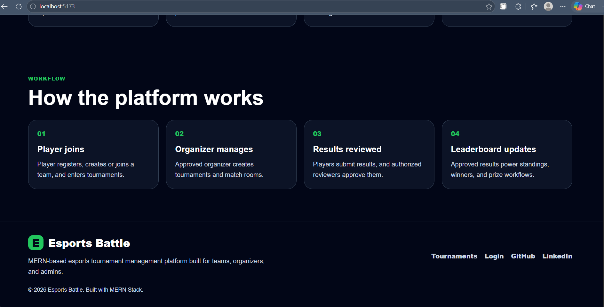
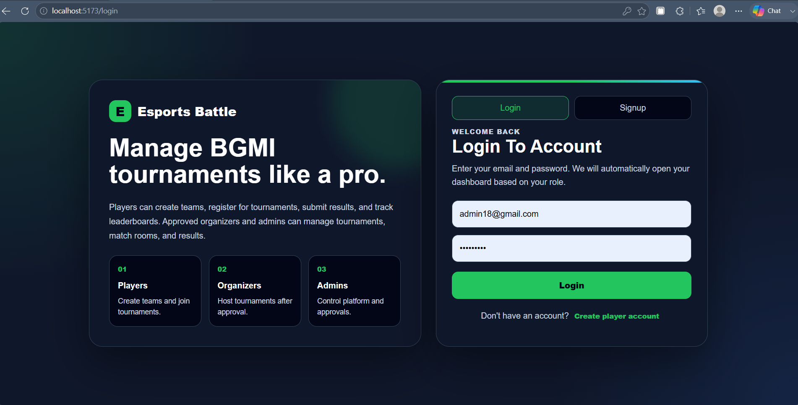
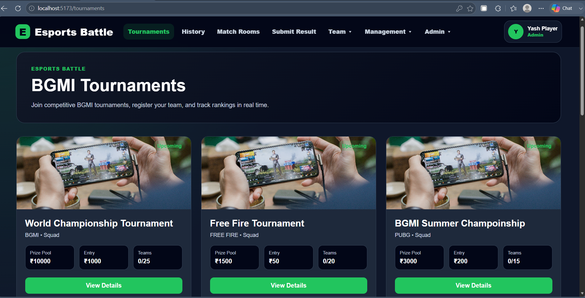
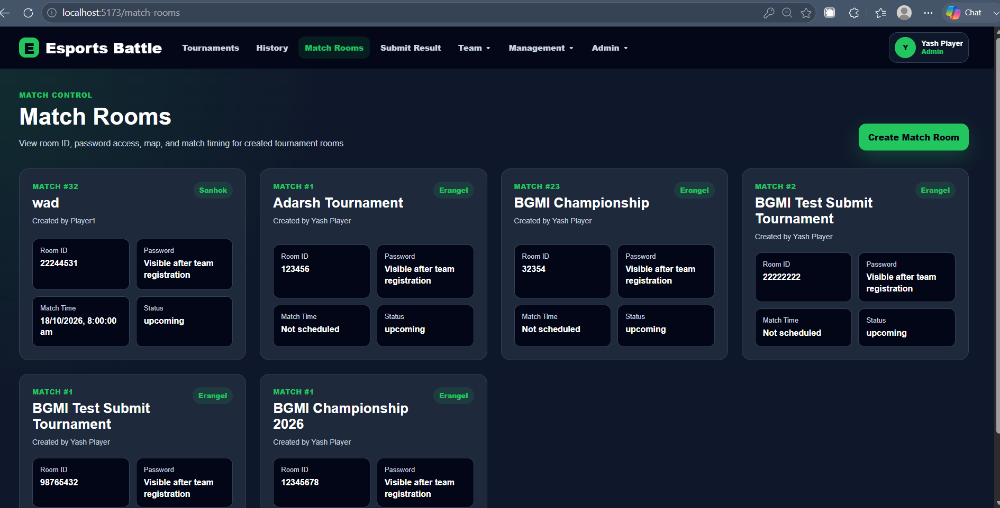
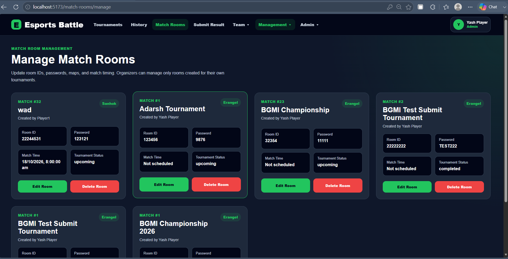
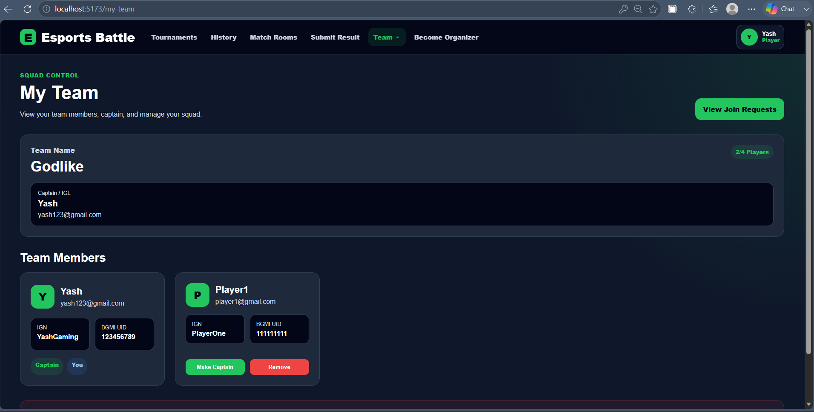
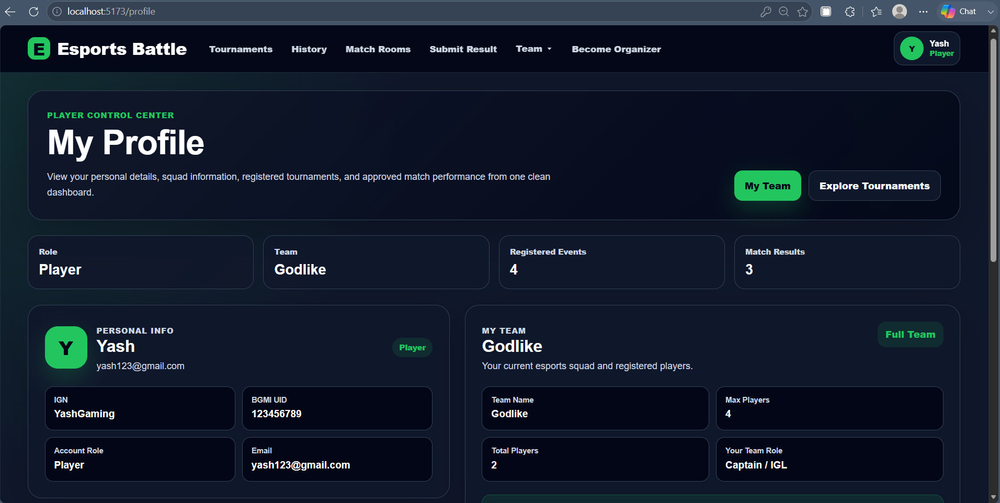
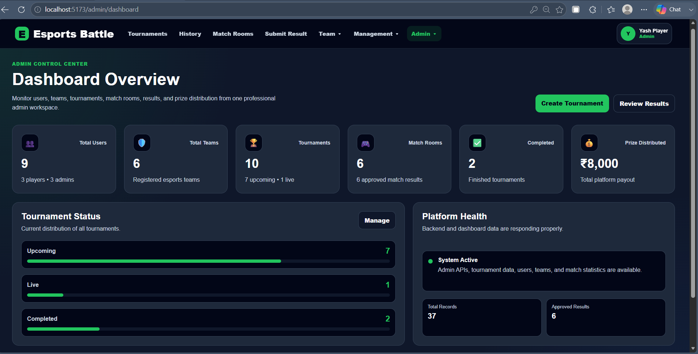

# Esports Battle - MERN Tournament Management Platform

Esports Battle is a full-stack MERN esports tournament management platform where players can create teams, register for tournaments, access match rooms, submit results, and track performance. Organizers can manage their own tournaments and match rooms, while admins and superAdmins can control platform-level operations.

---

## 🚀 Features

- Player registration and login with JWT authentication
- Team creation, join requests, approvals, captain transfer, and team management
- Organizer application and admin approval workflow
- Tournament creation and role-based tournament management
- Match room creation and secure room password access
- Room passwords visible only to eligible registered teams or authorized managers
- Result submission and approval system
- Organizer can approve results only for their own tournaments
- Admin and superAdmin platform control
- Notifications for team requests and tournament updates
- Public landing page and dashboard-style UI

---

## 🧑‍💻 Role System

| Role       | Permissions                                                                   |
| ---------- | ----------------------------------------------------------------------------- |
| Player     | Create/join teams, register for tournaments, submit results, view match rooms |
| Organizer  | Create/manage own tournaments and match rooms, review own tournament results  |
| Admin      | Manage users, teams, organizers, tournaments, match rooms, and results        |
| SuperAdmin | Full platform-level control                                                   |

---

## 🛠️ Tech Stack

### Frontend

- React
- Vite
- React Router
- Axios
- CSS Modules

### Backend

- Node.js
- Express.js
- MongoDB
- Mongoose
- JWT Authentication
- Bcrypt
- Zod Validation
- Helmet
- Express Rate Limit

---

## 📸 Screenshots

### Landing Page - Hero Section



### Landing Page - Features



### Landing Page - Footer



### Login Page



### Tournaments Page



### Match Rooms Page



### Manage Match Rooms Page



### My Team Page



### Profile Page



### Admin Dashboard



---

## ⚙️ Environment Variables

Create `.env` file inside the `server` folder:

```env
NODE_ENV=development
PORT=5000

MONGODB_URI=your_mongodb_connection_string
JWT_SECRET=your_strong_jwt_secret

CLIENT_URL=http://localhost:5173

RATE_LIMIT_WINDOW_MS=900000
RATE_LIMIT_MAX=300

AUTH_RATE_LIMIT_WINDOW_MS=900000
AUTH_RATE_LIMIT_MAX=20
```
